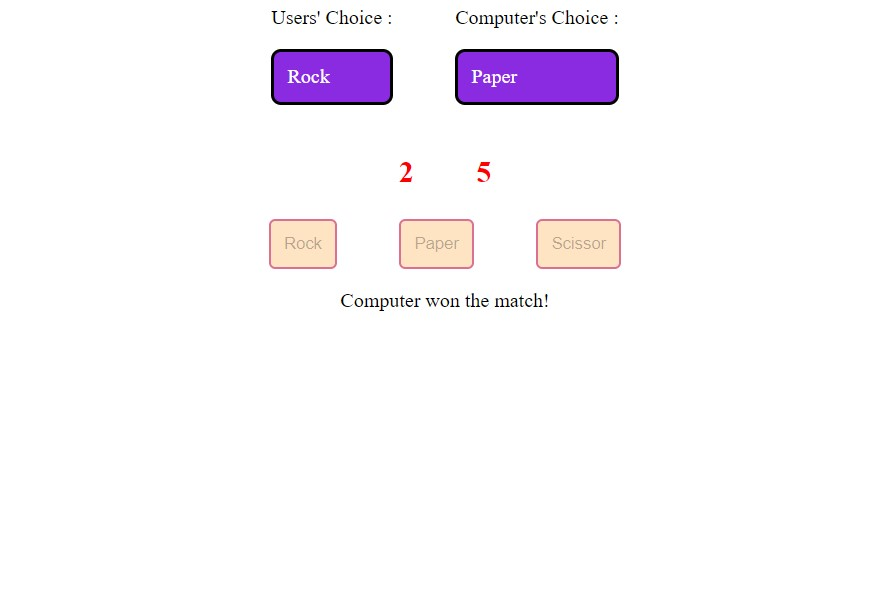

# Rock, Paper, Scissors
This is a JavaScript based Rock, Paper and Scissors game. It is a excercise for learning JavaScript from the Odin Project Full Stack Web Development.

## Objectives of this project
* Learn about JavaScript methods.
* Create a game with JavaScript.
* Learn about functions.
* Problem solving in JavaScript.
* Debugging in developers console.

## Screenshot
